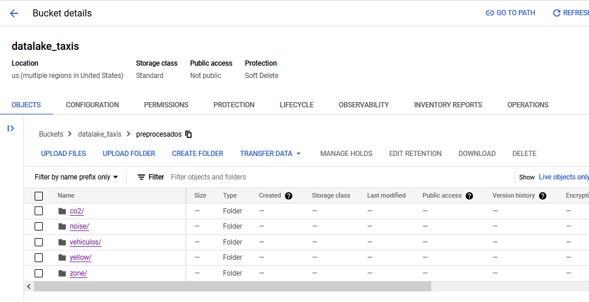
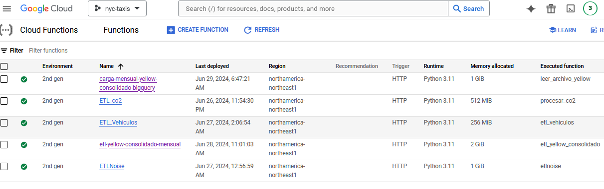
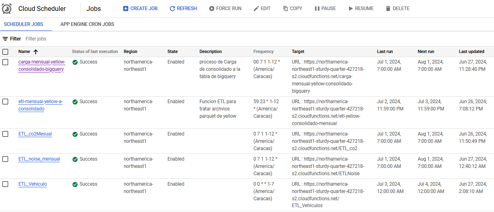
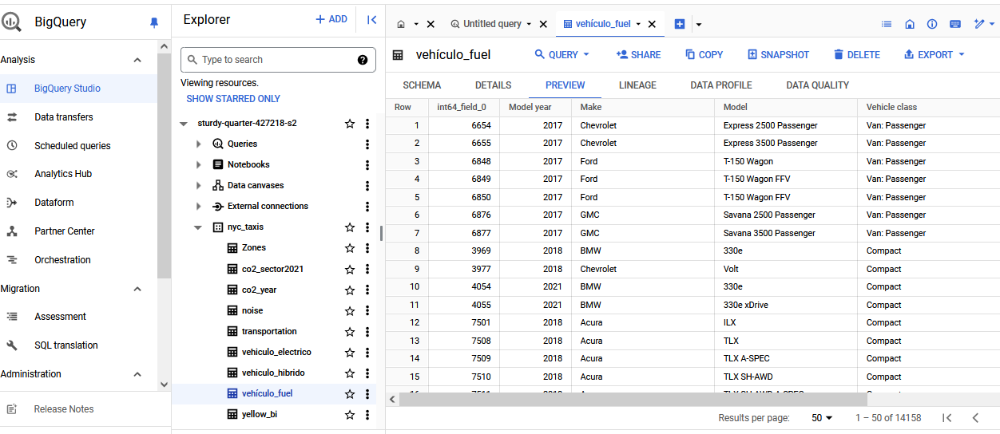
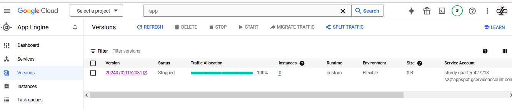

# Introducción

Google Cloud Platform (GCP) ofrece una suite robusta y flexible de servicios en la nube diseñados para satisfacer las necesidades de empresas de todos los tamaños. Con GCP, las organizaciones pueden aprovechar la infraestructura global de Google para alojar aplicaciones, almacenar y analizar datos, y desarrollar soluciones avanzadas de inteligencia artificial y machine learning. Los servicios en la nube de Google Cloud permiten una escalabilidad sin precedentes, seguridad robusta, y una integración perfecta con herramientas de desarrollo y gestión. Desde el despliegue de aplicaciones web hasta la construcción de potentes pipelines de datos, Google Cloud facilita la innovación y mejora la eficiencia operativa, permitiendo a las empresas centrarse en su crecimiento y en la creación de valor.

# Propuesta

        

 

# Justificación

Google Cloud ofrece una infraestructura escalable adaptable a las necesidades de crecimiento de cualquier organización. Un servicio Google Storage, para un Data Lake , que permite almacenar cantidades masivas de datos sin preocuparse por las limitaciones de capacidad. Además, Google BigQuery, como plataforma de analíticas de datos, que permite realizar consultas de manera rápida y eficiente, lo que es esencial para el análisis de grandes volúmenes de datos.
Google Cloud proporciona una integración entre distintos servicios. El proceso ETL/ELT que puede ser gestionado eficientemente utilizando herramientas como Google Cloud Dataflow, que permite el procesamiento de datos en tiempo real y por lotes. La compatibilidad de BigQuery con diversas herramientas de ETL/ELT garantiza que los datos sean procesados y transferidos sin problemas desde el data lake a BigQuery.

# Servicios utilizados

## Cloud Storage

Google Cloud Storage es un servicio de almacenamiento de objetos totalmente administrado, seguro y altamente disponible que forma parte de Google Cloud Platform. Está diseñado para almacenar y acceder a datos de manera fácil y escalable, siendo ideal para una amplia variedad de necesidades de almacenamiento y casos de uso.

Diseño del Datalake que almacenerá datos en brutos y limpios.

        

 

## Cloud Functions

Google Cloud Functions es una plataforma de computación sin servidor (serverless) ofrecida por Google Cloud Platform que permite a los desarrolladores ejecutar fragmentos de código en respuesta a eventos específicos, sin necesidad de gestionar ni escalar la infraestructura subyacente.

Implementación de las funciones que ejecutará los procesos de extracción, transformación y carga.

        

 

## Cloud Scheduler

Google Cloud Scheduler es un servicio de Google Cloud Platform que permite programar tareas de manera automática y recurrente en la nube. Esencialmente, es un planificador de cron completamente administrado que permite ejecutar trabajos en intervalos específicos sin necesidad de gestionar servidores o infraestructura.

Implementación programada de los procesos de extracción, transformación y carga.

        

 

## Bigquery

Google BigQuery es un servicio de almacenamiento y análisis de datos totalmente administrado y altamente escalable ofrecido por Google Cloud Platform. Está diseñado para procesar grandes conjuntos de datos de forma rápida y eficiente, permitiendo a los usuarios ejecutar consultas SQL para obtener información valiosa y tomar decisiones basadas en datos.

Implementación de un data warehouse para almacenar los datos.

        

 

## App Engine

Google App Engine es una plataforma como servicio (PaaS) proporcionada por Google Cloud Platform. Permite a los desarrolladores crear y desplegar aplicaciones web y móviles sin necesidad de gestionar la infraestructura subyacente. Con App Engine, los desarrolladores pueden centrarse en escribir código mientras Google maneja automáticamente el escalado, el balanceo de carga, la seguridad y el mantenimiento del servidor

Despliegue de la aplicación Streamlit para el modelo predictivo.

        

 
