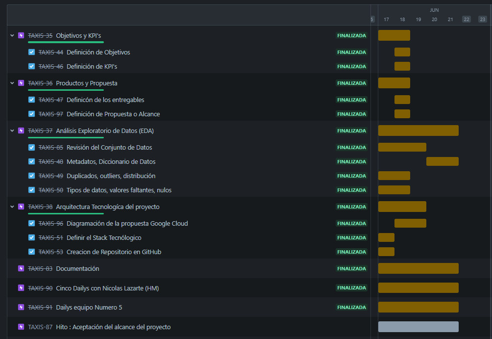
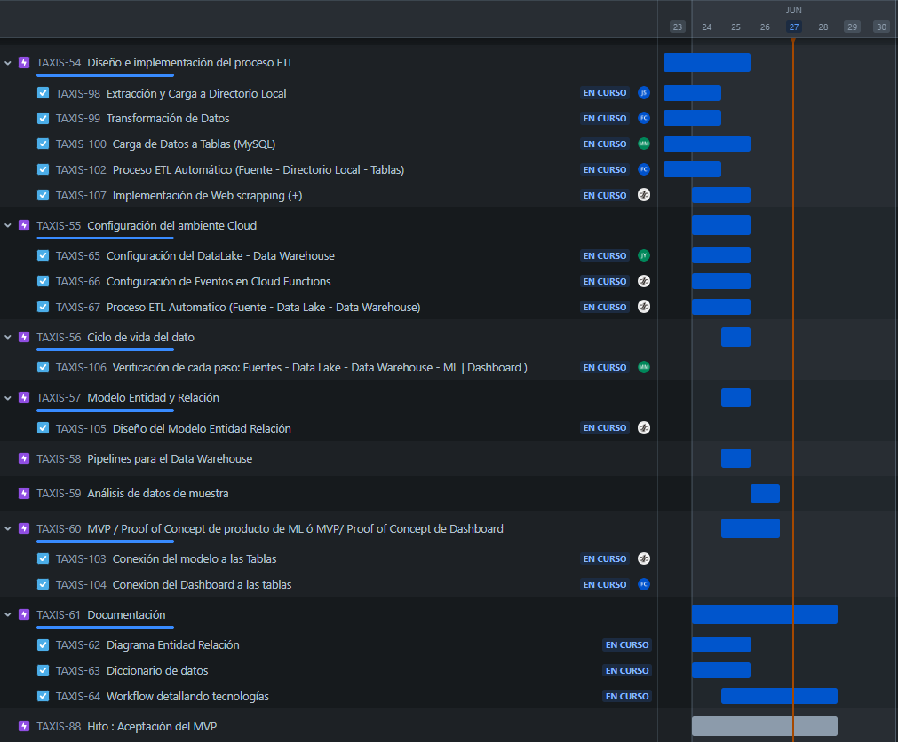
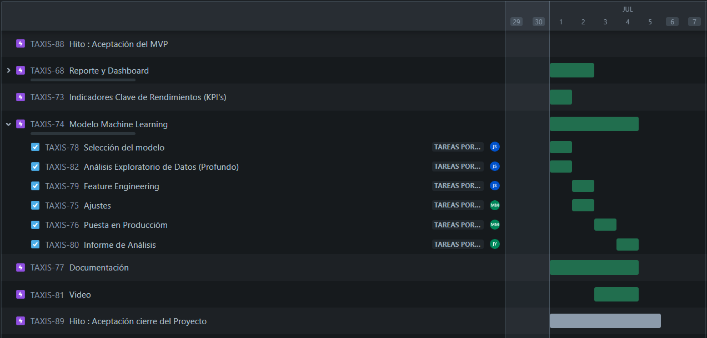

# Proyecto: Implementación de una Flota de Taxis Eléctricos en Nueva York

    
   
    

## Contenido

* [Introdcción](#Introducción)

* [Descripción](#Descripción)

* [Conjunto de Datos](#Conjunto-de-Datos)

* [Propuesta](#Propuesta)

* [Objetivo General y Específicos](#Objetivo-General-y-Específicos)

* [Indicadores claves de Desempeño](#Indicadores-claves-de-Desempeño)

* [Tecnologías utilizadas](#Tecnologías-Utilizadas)

* [Conclusión](#Conclusión)

* [Recomendaciones](#Recomendaciones)

* [Autores](#Autores)

## Introducción

Sabemos que la movilidad en las ciudades es un tema importante, el tránsito de vehículos en New York no es la excepción, se ha aumentado la demanda de taxis y con ella se han visto afectadas otras dimesiones. El transporte es el sector que más emisiones de CO2 produce en Estados Unidos. Para mitigar su impacto ambiental sin descuidar las necesidades de transporte, este proyecto explotarará la incorporación de una flota de taxis eléctricos en New York.

## Descripción

El objetivo principal de este proyecto es analizar la viabilidad de implementar una flota de taxis eléctricos en Nueva York, considerando su impacto en la reducción de emisiones de CO2, la mejora de la calidad del aire y la reducción de la contaminación sonora.

## Conjunto de Datos

1. **Data de viajes**
2. **Dataset de Kaggle sobre emisiones de CO2 por país y año, con ajustes por población**
3. **Dataset de los sonidos recolectados en NYC**
4. **Dataset de la calidad del aire de NYC**
5. **Electric car and Fuel car**

## Propuesta 

**Esquema de datos en la nube**: Un sistema organizado de almacenamiento y procesamiento de datos en la nube, donde se gestionará la información y se distribuirá a los componentes necesarios.

**Aplicativo de Machine Learning**: Una aplicación basada en Machine Learning que funcionará como calculadora de tarifas de viajes, ajustando el precio en función de la distancia y el tiempo del recorrido, garantizando así un costo justo para cada viaje.

**Dashboard interactivo**: Un tablero de control interactivo que presentará información relevante basada en los KPI definidos, promoviendo una toma de decisiones informada y efectiva.

        

## Objetivo General y Específicos

### Objetivo General

Evaluar la viabilidad y el impacto de la implementación de vehículos Eléctricos / Híbridos / Gasolina en la flota de transporte de pasajeros de la empresa, utilizando datos de viajes en taxis y servicios de transporte compartido en Nueva York, así como datos de calidad del aire, para proporcionar recomendaciones estratégicas basadas en análisis de datos robustos

### Objetivos Específicos

1. Evaluar la viabilidad económica de la implementación de distintos tipos de vehículos, considerando costos, rendimiento y retorno de inversión, entre otros factores.
2. Estudiar cómo la implementación de taxis alternativos mejora la calidad del aire en Nueva York, comparando datos de calidad del aire antes y después de la implementación.
3. Proporcionar un modelo de Machine Learning que ayude en distintos aspectos del proyecto, como el cálculo de tarifas de los viajes.
4. Comparar las emisiones de CO2 entre taxis tradicionales y taxis alternativos para analizar la viabilidad ambiental.
5. Analizar la demanda de taxis en diferentes zonas para poder focalizar la operación.
6. Brindar toda la información posible y útil al cliente para que pueda tomar decisiones informadas y basadas en datos.

## Indicadores claves de Desempeño

1. **TasaReducción_Carbono**: Reducir en un 50% la emisión de dióxido de carbono en comparación con los taxis tradicionales a gasolina, alcanzar esta meta en un plazo de 1 año.
   

$\frac{\text{Cantidad de carbono emitida por taxis alternativos}}{\text{Cantidad de carbono emitida por taxis tradicionales}} \times 100$ 

2. **TasaGanancia_Bruta**: Superar en un 10% la tasa media de ganancia bruta con taxis alternativos respecto a los taxis tradicionales, Alcanzar esta meta en un plazo de 1 año

   

$\frac{\text{Ganancia bruta taxis alternativos}}{\text{Ganancia bruta taxis tradicionales}} \times 100$

  **Ganancia Bruta = Ingreso por Taxi - Costos de Combustible**

3. **Tiempo_Retorno_Inversión**: Medir el retorno de inversión de la implementación de la flota de taxis y Lograr el retorno de la inversión en menos de 5 años.

   

$\frac{\text{Inversión total}}{\text{Ganancia bruta diaria}}$

## Tecnologías Utilizadas

### Herramientas de Organización y Comunicación

 **Discord**: Para la comunicación en tiempo real y la colaboración en equipo.

 **Slack**: Para la gestión de conversaciones y la integración con otras herramientas.

 **Google Meet**: Para videoconferencias y reuniones virtuales.

 **Trello / Jira**: Para la gestión de proyectos y seguimiento de tareas.

### Herramientas de Trabajo en la Elaboración del ETL y el EDA

  **Git**: Para el control de versiones y la colaboración en el desarrollo de código.

</a> **Python**: Utilizado con librerías específicas para data science como Numpy, Pandas, Matplotlib, entre otras.

### Infraestructura Tecnológica para el Ciclo de Datos

**Propuesta 1**: Local

* **Docker**: Para la contenedorización y despliegue de aplicaciones.
* **Datalake Hadoop**: Para el almacenamiento y procesamiento de grandes volúmenes de datos.
* **Orquestador Airflow**: Para la gestión y procesamiento de grandes volúmenes de datos.
* **MySQL**: Para el almacenamiento y gestión de bases de datos relacionales.
* **Render (ML)**: Para el despliegue y ejecución de modelos de machine learning.

**Propuesta 2**: Servicios de la Nube

        

 

* **Lucidchart**: Como software de diagramación online.
* **Cloud Storage**: Para el almacenamiento de datos en la nube.
* **Cloud Functions**: Para la ejecución de código sin necesidad de gestionar servidores.
* **BigQuery**: Para el análisis y procesamiento de grandes conjuntos de datos.

### Herramientas para la Visualización de Datos

 **Power BI**: Para la creación de informes interactivos y dashboards.

 **Streamlit**: Para la creación de aplicaciones web interactivas y visualización de datos en tiempo real.

### Herramienta para Presentaciones Visuales

 **Prezi**: Para la creación de presentaciones dinámicas y visualmente atractivas.

### Justificación de Utilizar Google Cloud

Google Cloud ofrece una infraestructura escalable adaptable a las necesidades de crecimiento de cualquier organización. Un servicio Google Storage, para un Data Lake , que permite almacenar cantidades masivas de datos sin preocuparse por las limitaciones de capacidad. Además, Google BigQuery, como plataforma de analíticas de datos, que permite realizar consultas de manera rápida y eficiente, lo que es esencial para el análisis de grandes volúmenes de datos.
Google Cloud proporciona una integración entre distintos servicios. El proceso ETL/ELT que puede ser gestionado eficientemente utilizando herramientas como Google Cloud Dataflow, que permite el procesamiento de datos en tiempo real y por lotes. La compatibilidad de BigQuery con diversas herramientas de ETL/ELT garantiza que los datos sean procesados y transferidos sin problemas desde el data lake a BigQuery.

### Diagram de E/R de la base de datos 

A continuación, se presenta el diagrama de Entidad-Relación (E/R) de nuestra base de datos. Este diagrama ilustra las entidades principales, sus atributos y las relaciones entre ellas, proporcionando una visión clara de la estructura y organización de los datos. Es una herramienta fundamental para entender cómo se conectan y se interactúan los distintos componentes de la base de datos.

 

## Diagrama de de gantt y las distribución la tareas en la semanas

Adoptamos SCRUM con reuniones diarias para revisar el avance y organizar las actividades. Empleamos un gráfico de Gantt y Jira para representar las tareas, sus tiempos y relaciones, lo que simplifica la organización y monitoreo del proyecto. Además, hemos dividido el proyecto en tres sprints para una gestión más efectiva y un seguimiento más detallado de cada fase

### Sprint 1
 

### Sprint 2
 

### Sprint 3
 

## Contribución

Por favor, sigue estas pautas para contribuir al proyecto:
1. Realiza un fork del repositorio.
2. Crea una nueva rama (`git checkout -b feature/nueva-feature`).
3. Realiza tus cambios y commitea (`git commit -m 'Añadir nueva feature'`).
4. Sube tus cambios (`git push origin feature/nueva-feature`).
5. Abre un Pull Request.

## Conclusión

## Recomendaciones

## Autores

La dedicación y el trabajo en equipo de estas personas hicieron posible la realización de este proyecto

| [ Juan Camilo Torres Salas](https://github.com/JuankTS/JuankTS) | [ Adrian Facundo Corvalan](https://github.com/facu-corvalan) | [ Javier Yañez](https://github.com/javyleonhart) | [ Michael Martinez](https://github.com/bkmay1417) | [ Jesus H. Parra B.](https://github.com/ing-jhparra)
| :---: | :---: | :---: | :---: | :---: |
